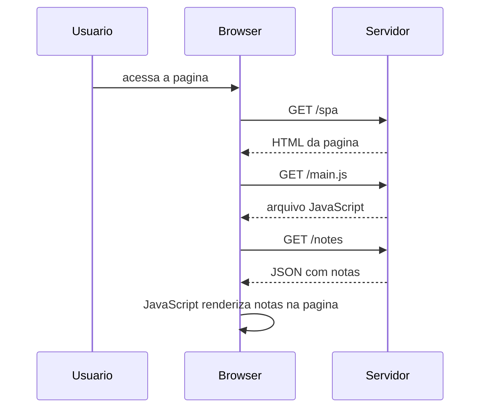

# 0.5.md spa

```mermaid
sequenceDiagram
    participant Usuario
    participant Browser
    participant Servidor

    Usuario->>Browser: acessa a pagina
    Browser->>Servidor: GET /spa
    Servidor-->>Browser: HTML da pagina

    Browser->>Servidor: GET /main.js
    Servidor-->>Browser: arquivo JavaScript

    Browser->>Servidor: GET /notes
    Servidor-->>Browser: JSON com notas

    Browser->>Browser: JavaScript renderiza notas na pagina
```